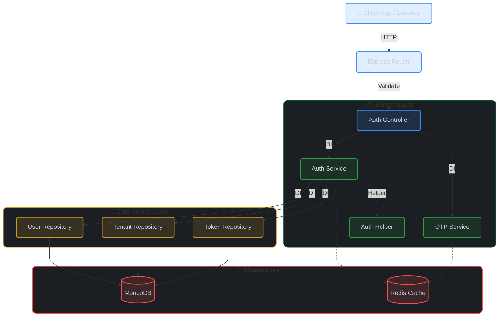

<div align="center">
  <h1>🔐 Fleet OS Auth Service</h1>
  <p>
    <strong>Secure Authentication, Authorization & Tenant Management Microservice</strong>
  </p>

[](https://opensource.org/licenses/MIT)


  <p>
    <a href="#-architecture">Architecture</a> •
    <a href="#-technology-stack">Tech Stack</a> •
    <a href="#-project-structure">Structure</a> •
    <a href="#-configuration">Configuration</a> •
    <a href="#-api-endpoints">API</a>
  </p>
</div>

---

## 📖 Overview

The **Fleet OS Auth Service** is the backbone of security within the Fleet OS ecosystem. It robustly handles identity management, ensuring that users and tenants are authenticated and authorized securely.

### ✨ Key Features

- **Multi-Tenancy**: Built-in support for tenant isolation and management.
- **Secure Authentication**: JWT-based stateless authentication with RS256 signing.
- **RBAC**: Granular Role-Based Access Control integration.
- **OTP Verification**: Secure 2FA flows for registration.
- **Token Management**: Refresh token rotation and revocation capabilities.

---

## 🏛 Architecture

This service follows a **Clean, N-Layered Architecture** to ensure modularity and scalability.



### 🧠 Design Patterns

- **Repository Pattern**: Decouples business logic from data access.
- **Dependency Injection**: Powered by [InversifyJS](https://inversify.io/) for loose coupling.
- **DTOs**: Strict data validation using `Zod` schemas.

---

## 🛠 Technology Stack

| Category      | Technology                                                                                                      | Description                               |
| :------------ | :-------------------------------------------------------------------------------------------------------------- | :---------------------------------------- |
| **Runtime**   |          | Server-side JavaScript runtime            |
| **Language**  |  | Statically typed JavaScript               |
| **Framework** |        | Fast, unopinionated web framework         |
| **Database**  |           | NoSQL database                            |
| **Cache**     |                 | In-memory data store                      |
| **Security**  | **Argon2** & **JWT**                                                                                            | Best-in-class hashing and token standards |

---

## 📂 Project Structure

```bash
src/
├── config/           # ⚙️ Configuration & ENV validation
├── controllers/      # 🎮 Route handlers (Entry point)
├── di/               # 💉 Dependency Injection container
├── dto/              # 📝 Data Transfer Objects (Validation)
├── middlewares/      # 🛡️ Auth, Role & Logic Middlewares
├── models/           # 🗄️ Mongoose Schemas & Models
├── repositories/     # 💾 Database interactions
├── routes/           # 🛣️ API Route definitions
├── services/         # 🧠 Core Business Logic
├── types/            # 🏷️ TypeScript definitions
├── utils/            # 🛠️ Helper utilities
├── app.ts            # 🚀 App configuration
└── server.ts         # 🏁 Server entry point
```

---

## � Configuration

### 🔑 Generating RS256 Keys

This service uses **Asymmetric Cryptography (RS256)** for JWTs. You must generate a Private/Public key pair securely.

**Run the following commands in your terminal:**

```bash
# 1. Generate Private Key
openssl genpkey -algorithm RSA -out private_key.pem -pkeyopt rsa_keygen_bits:2048

# 2. Generate Public Key
openssl rsa -pubout -in private_key.pem -out public_key.pem
```

> **Note**: In production, manage these keys securely (e.g., AWS Secrets Manager, Vault).

### 🌍 Environment Variables

Copy `.env.example` to `.env` and fill in the values:

| Variable       | Description                       | Example / Default                         |
| :------------- | :-------------------------------- | :---------------------------------------- |
| `NODE_ENV`     | Application environment           | `development`                             |
| `PORT`         | Service port                      | `3001`                                    |
| `DATABASE_URL` | MongoDB connection string         | `mongodb://localhost:27017/fleet-os-auth` |
| `REDIS_URL`    | Redis connection URL              | `redis://localhost:6379`                  |
| `CLIENT_URL`   | Frontend URL for generating links | `http://localhost:3000`                   |
| `PRIVATE_KEY`  | RSA Private Key (PEM format)      | (Paste content of `private_key.pem`)      |
| `PUBLIC_KEY`   | RSA Public Key (PEM format)       | (Paste content of `public_key.pem`)       |

---

## �🔌 API Endpoints

All endpoints are prefixed with `/api/v1/auth`.

### 🔓 Public

| Method | Endpoint           | Description                        |
| :----- | :----------------- | :--------------------------------- |
| `POST` | `/register-tenant` | Register a new tenant organization |
| `POST` | `/register-admin`  | Register a tenant administrator    |
| `POST` | `/verify-otp`      | Verify OTP for registration        |
| `POST` | `/resend-otp`      | Resend OTP code                    |
| `POST` | `/login`           | User login (Returns JWT)           |
| `POST` | `/refresh`         | Refresh access token               |
| `POST` | `/accept-invite`   | Set password for invited user      |

### 🔐 Protected

| Method | Endpoint      | Role | Description            |
| :----- | :------------ | :--- | :--------------------- |
| `POST` | `/logout`     | All  | Logout current session |
| `POST` | `/logout-all` | All  | Revoke all sessions    |

### 👮 Admin Operations

| Method | Endpoint           | Role             | Description                          |
| :----- | :----------------- | :--------------- | :----------------------------------- |
| `GET`  | `/tenants`         | `PLATFORM_ADMIN` | List all tenants                     |
| `GET`  | `/tenants/pending` | `PLATFORM_ADMIN` | List pending tenants                 |
| `POST` | `/verify-tenant`   | `PLATFORM_ADMIN` | Verify tenant & generate admin link  |
| `POST` | `/invite-user`     | `ADMINs`         | Invite internal users (Driver, etc.) |

---

## 📄 License

This project is licensed under the **MIT License**.
