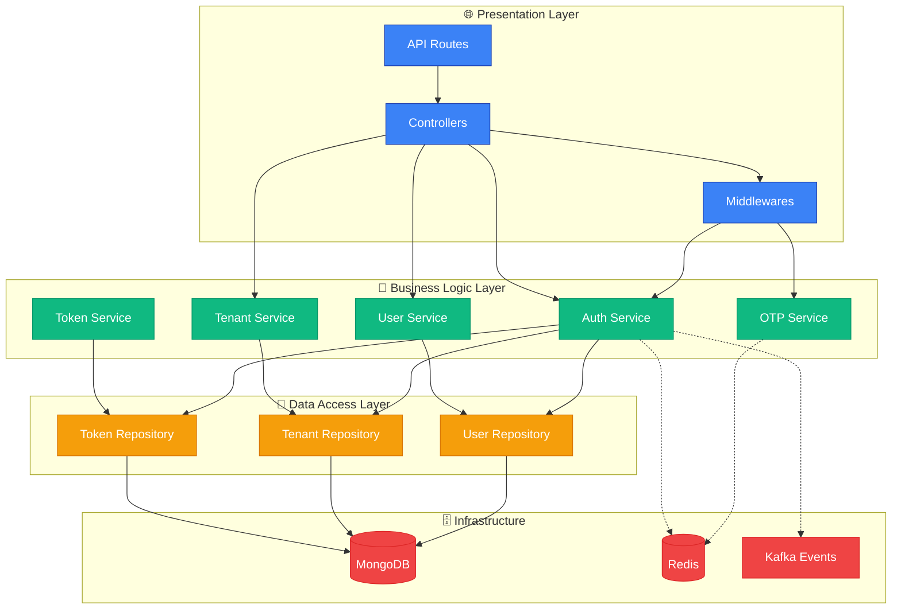
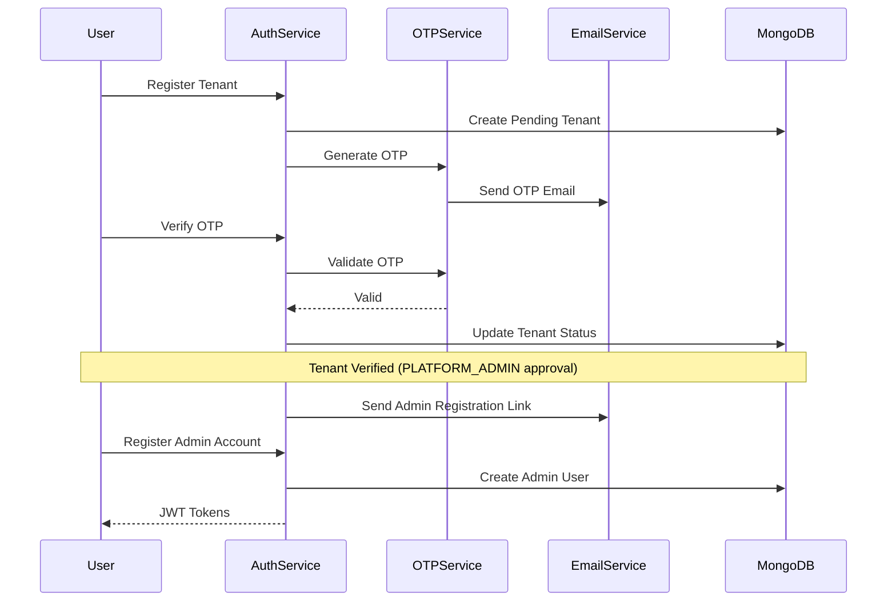
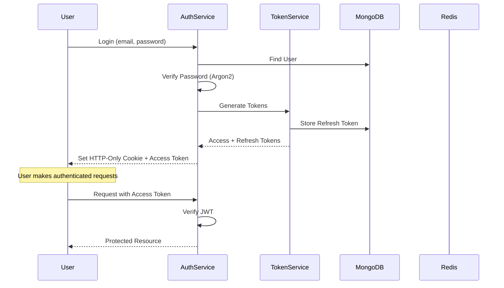

<div align="center">
  <h1>🔐 Fleet OS Auth Service</h1>
  <p>
    <strong>Secure Authentication, Authorization & Multi-Tenant User Management</strong>
  </p>

[](https://opensource.org/licenses/MIT)


  <p>
    <a href="#-overview">Overview</a> •
    <a href="#-architecture">Architecture</a> •
    <a href="#-key-features">Features</a> •
    <a href="#-technology-stack">Tech Stack</a> •
    <a href="#-getting-started">Getting Started</a> •
    <a href="#-api-endpoints">API</a>
  </p>
</div>

---

## 📖 Overview

The **Fleet OS Auth Service** is the central authentication and authorization microservice for the Fleet OS platform - a comprehensive fleet and logistics management system. It provides secure, scalable user identity management with multi-tenancy support, enabling platform admins, tenant organizations, and various user roles to interact safely within their isolated environments.

### 🎯 Purpose

This service handles all authentication, authorization, and user management concerns for the Fleet OS ecosystem, including:

- **Platform Administration**: Super admins who manage the entire platform
- **Tenant Management**: Organization-level access control
- **Role-Based Access**: Multiple roles (Tenant Admin, Operations Manager, Driver)
- **User Lifecycle**: Registration, verification, invitation, onboarding
- **Session Management**: Secure JWT-based authentication with refresh tokens

---

## ✨ Key Features

### 🏢 Multi-Tenancy
- **Tenant Isolation**: Complete data separation between organizations
- **Tenant Registration**: Self-service org registration with OTP verification
- **Tenant Administration**: Platform admins can verify/reject tenant applications
- **Tenant Status Management**: PENDING, VERIFIED, REJECTED states

### 🔐 Authentication & Authorization
- **JWT-Based Auth**: Stateless authentication using RS256 asymmetric encryption
- **Refresh Tokens**: Secure token rotation stored in MongoDB
- **Role-Based Access Control (RBAC)**: Fine-grained permissions across 4 roles:
  - `PLATFORM_ADMIN` - Platform-wide administration
  - `TENANT_ADMIN` - Organization management
  - `OPERATIONS_MANAGER` - Fleet operations
  - `DRIVER` - Delivery driver access

### 👥 User Management
- **User Invitation System**: Admins can invite users via email
- **OTP Verification**: 2FA flow for new registrations
- **Driver Onboarding**: Special onboarding flow for drivers
- **User Status Control**: Block/unblock users and manage access

### 🔒 Security Features
- **Argon2 Password Hashing**: Industry-leading secure password storage
- **HTTP-Only Cookies**: Refresh tokens stored securely
- **Rate Limiting**: Protection against brute force attacks (Redis-based)
- **CORS Protection**: Configurable cross-origin resource sharing
- **Helmet Security Headers**: Industry-standard HTTP security headers

### 📊 Session & Token Management
- **Multi-Device Support**: Users can have multiple active sessions
- **Token Revocation**: Logout from specific devices or all devices
- **Refresh Token Rotation**: Security through token cycling
- **Redis Caching**: Fast OTP validation and rate limiting

---

## 🏛 Architecture

This service follows **Clean Architecture** principles with clear separation of concerns.


```mermaid
graph TB
    subgraph "🌐 Presentation Layer"
        Routes[API Routes]
        Controllers[Controllers]
        Middleware[Middlewares]
    end

    subgraph "💼 Business Logic Layer"
        AuthService[Auth Service]
        OtpService[OTP Service]
        TenantService[Tenant Service]
        UserService[User Service]
        TokenService[Token Service]
    end

    subgraph "💾 Data Access Layer"
        UserRepo[User Repository]
        TenantRepo[Tenant Repository]
        TokenRepo[Token Repository]
    end

    subgraph "🗄️ Infrastructure"
        MongoDB[(MongoDB)]
        Redis[(Redis)]
        Kafka[Kafka Events]
    end

    Routes --> Controllers
    Controllers --> Middleware
    Middleware --> AuthService
    Middleware --> OtpService
    Controllers --> AuthService
    Controllers --> TenantService
    Controllers --> UserService
    
    AuthService --> UserRepo
    AuthService --> TenantRepo
    AuthService --> TokenRepo
    TenantService --> TenantRepo
    UserService --> UserRepo
    TokenService --> TokenRepo
    
    UserRepo --> MongoDB
    TenantRepo --> MongoDB
    TokenRepo --> MongoDB
    
    OtpService -.-> Redis
    AuthService -.-> Redis
    AuthService -.-> Kafka

    classDef presentation fill:#3b82f6,stroke:#1e40af,color:#fff
    classDef business fill:#10b981,stroke:#059669,color:#fff
    classDef data fill:#f59e0b,stroke:#d97706,color:#fff
    classDef infra fill:#ef4444,stroke:#dc2626,color:#fff

    class Routes,Controllers,Middleware presentation
    class AuthService,OtpService,TenantService,UserService,TokenService business
    class UserRepo,TenantRepo,TokenRepo data
    class MongoDB,Redis,Kafka infra
```

### 🧠 Design Patterns

- **Repository Pattern**: Abstracts data access behind interfaces
- **Dependency Injection**: Uses InversifyJS for IoC container management
- **DTO Pattern**: Zod schemas for request/response validation
- **Service Layer Pattern**: Encapsulates business logic
- **Middleware Pattern**: Composable request processing pipeline

---

## 🛠 Technology Stack

| Category | Technology | Purpose |
|:---------|:-----------|:--------|
| **Runtime** |  | JavaScript runtime |
| **Language** |  | Type-safe development |
| **Framework** |  | Web framework |
| **Database** |  | Document database |
| **Cache** |  | Session & rate limiting |
| **Security** | **Argon2** & **JWT (RS256)** | Password hashing & tokens |
| **DI Container** | **InversifyJS** | Dependency injection |
| **Validation** | **Zod** | Runtime type checking |
| **Logging** | **Winston** | Structured logging |
| **Testing** | **Jest** | Unit & integration tests |
| **Messaging** | **KafkaJS** | Event streaming |

---

## 📂 Project Structure

```
fleet-os-auth-service/
├── src/
│   ├── config/              # ⚙️ Environment & configuration
│   │   ├── database.ts      # MongoDB connection
│   │   ├── redis.ts         # Redis client setup
│   │   ├── kafka.ts         # Kafka producer/consumer
│   │   └── keys.ts          # RSA key management
│   │
│   ├── controllers/         # 🎮 HTTP request handlers
│   │   ├── auth.controller.ts
│   │   ├── tenant.controller.ts
│   │   ├── user.controller.ts
│   │   └── driver.controller.ts
│   │
│   ├── di/                  # 💉 Dependency injection setup
│   │   └── container.ts     # IoC container configuration
│   │
│   ├── dto/                 # 📝 Data transfer objects & validation
│   │   ├── auth.dto.ts
│   │   ├── tenant.dto.ts
│   │   └── user.dto.ts
│   │
│   ├── middlewares/         # 🛡️ Request processing middleware
│   │   ├── auth.middleware.ts       # JWT validation
│   │   ├── role.middleware.ts       # RBAC enforcement
│   │   ├── validate.middleware.ts   # Zod schema validation
│   │   └── error.middleware.ts      # Global error handling
│   │
│   ├── models/              # 🗄️ Mongoose schemas
│   │   ├── User.ts
│   │   ├── Tenant.ts
│   │   └── RefreshToken.ts
│   │
│   ├── repositories/        # 💾 Data access layer
│   │   ├── user.repository.ts
│   │   ├── tenant.repository.ts
│   │   └── token.repository.ts
│   │
│   ├── routes/              # 🛣️ API route definitions  
│   │   ├── auth.routes.ts
│   │   ├── tenant.routes.ts
│   │   ├── user.routes.ts
│   │   └── driver.routes.ts
│   │
│   ├── services/            # 🧠 Business logic
│   │   ├── authService/
│   │   ├── otpService/
│   │   ├── tenantService/
│   │   ├── userService/
│   │   └── tokenService/
│   │
│   ├── types/               # 🏷️ TypeScript type definitions
│   ├── utils/               # 🛠️ Helper utilities
│   ├── app.ts               # Express app setup
│   └── index.ts             # Server entry point
│
├── tests/                   # 🧪 Test suites
│   ├── repositories/        # Repository unit tests
│   └── services/            # Service integration tests
│
├── .env.example             # Environment variables template
├── Dockerfile               # Production container
├── docker-compose.yml       # Local development stack
└── package.json
```

---

## 🚀 Getting Started

### Prerequisites

- **Node.js** >= 20.x
- **pnpm** >= 9.x
- **MongoDB** >= 6.x
- **Redis** >= 7.x

### Installation

1. **Clone the repository**
```bash
git clone https://github.com/ijas9118/fleet-os-auth-service.git
cd fleet-os-auth-service
```

2. **Install dependencies**
```bash
pnpm install
```

3. **Generate RSA keys for JWT signing**
```bash
# Generate private key
openssl genpkey -algorithm RSA -out private.pem -pkeyopt rsa_keygen_bits:2048

# Generate public key
openssl rsa -pubout -in private.pem -out public.pem
```

4. **Configure environment**
```bash
cp .env.example .env
# Edit .env with your configuration
```

5. **Run development server**
```bash
pnpm dev
```

The service will start on `http://localhost:3001` (or your configured port).

### Running Tests

```bash
# Run all tests
pnpm test

# Watch mode
pnpm test:watch

# Generate coverage report
pnpm test:coverage
```

### Building for Production

```bash
# Type check
pnpm typecheck

# Build
pnpm build

# Start production server
pnpm start
```

---

## 🔌 API Endpoints

Base URL: `/api/v1`

### 🔓 Public Endpoints

#### Authentication
| Method | Endpoint | Description |
|:-------|:---------|:------------|
| `POST` | `/auth/login` | User login - returns JWT access & refresh tokens |
| `POST` | `/auth/refresh` | Refresh access token using refresh token |
| `POST` | `/auth/resend-otp` | Resend OTP for verification |

#### Registration
| Method | Endpoint | Description |
|:-------|:---------|:------------|
| `POST` | `/tenants/register` | Register a new tenant organization |
| `POST` | `/auth/register-admin` | Register tenant admin (post-verification) |
| `POST` | `/auth/verify-otp` | Verify OTP for registration |
| `POST` | `/auth/accept-invite` | Accept user invitation & set password |

### 🔐 Protected Endpoints (Requires Authentication)

#### Session Management
| Method | Endpoint | Description | Roles |
|:-------|:---------|:------------|:------|
| `POST` | `/auth/logout` | Logout current session | All |
| `POST` | `/auth/logout-all` | Revoke all user sessions | All |

#### User Invitations
| Method | Endpoint | Description | Roles |
|:-------|:---------|:------------|:------|
| `POST` | `/auth/invite-user` | Invite new user to organization | `TENANT_ADMIN`, `OPERATIONS_MANAGER` |

### 👮 Platform Admin Endpoints

#### Tenant Management
| Method | Endpoint | Description | Roles |
|:-------|:---------|:------------|:------|
| `GET` | `/tenants` | List all verified tenants | `PLATFORM_ADMIN` |
| `GET` | `/tenants/pending` | List pending tenant applications | `PLATFORM_ADMIN` |
| `GET` | `/tenants/rejected` | List rejected tenants | `PLATFORM_ADMIN` |
| `POST` | `/tenants/verify` | Verify pending tenant | `PLATFORM_ADMIN` |
| `POST` | `/tenants/reject` | Reject tenant application | `PLATFORM_ADMIN` |

#### User Management
| Method | Endpoint | Description | Roles |
|:-------|:---------|:------------|:------|
| `GET` | `/users` | List all users | `PLATFORM_ADMIN`, `TENANT_ADMIN` |
| `POST` | `/users/block` | Block user access | `PLATFORM_ADMIN`, `TENANT_ADMIN` |
| `POST` | `/users/unblock` | Unblock user | `PLATFORM_ADMIN`, `TENANT_ADMIN` |

#### Operations Manager Management
| Method | Endpoint | Description | Roles |
|:-------|:---------|:------------|:------|
| `GET` | `/operations-managers` | List operations managers | `PLATFORM_ADMIN`, `TENANT_ADMIN` |
| `POST` | `/operations-managers/block` | Block operations manager | `PLATFORM_ADMIN`, `TENANT_ADMIN` |
| `POST` | `/operations-managers/unblock` | Unblock operations manager | `PLATFORM_ADMIN`, `TENANT_ADMIN` |

#### Driver Management
| Method | Endpoint | Description | Roles |
|:-------|:---------|:------------|:------|
| `GET` | `/drivers` | List all drivers | `PLATFORM_ADMIN`, `TENANT_ADMIN`, `OPERATIONS_MANAGER` |
| `POST` | `/drivers/block` | Block driver | `PLATFORM_ADMIN`, `TENANT_ADMIN`, `OPERATIONS_MANAGER` |
| `POST` | `/drivers/unblock` | Unblock driver | `PLATFORM_ADMIN`, `TENANT_ADMIN`, `OPERATIONS_MANAGER` |

---

## 🔐 Authentication Flow

### Registration & Onboarding


```mermaid
sequenceDiagram
    participant User
    participant AuthService
    participant OTPService
    participant EmailService
    participant MongoDB

    User->>AuthService: Register Tenant
    AuthService->>MongoDB: Create Pending Tenant
    AuthService->>OTPService: Generate OTP
    OTPService->>EmailService: Send OTP Email
    User->>AuthService: Verify OTP
    AuthService->>OTPService: Validate OTP
    OTPService-->>AuthService: Valid
    AuthService->>MongoDB: Update Tenant Status
    Note over User,MongoDB: Tenant Verified (PLATFORM_ADMIN approval)
    AuthService->>EmailService: Send Admin Registration Link
    User->>AuthService: Register Admin Account
    AuthService->>MongoDB: Create Admin User
    AuthService-->>User: JWT Tokens
```

### Login Flow


```mermaid
sequenceDiagram
    participant User
    participant AuthService
    participant TokenService
    participant MongoDB
    participant Redis

    User->>AuthService: Login (email, password)
    AuthService->>MongoDB: Find User
    AuthService->>AuthService: Verify Password (Argon2)
    AuthService->>TokenService: Generate Tokens
    TokenService->>MongoDB: Store Refresh Token
    TokenService-->>AuthService: Access + Refresh Tokens
    AuthService-->>User: Set HTTP-Only Cookie + Access Token
    Note over User: User makes authenticated requests
    User->>AuthService: Request with Access Token
    AuthService->>AuthService: Verify JWT
    AuthService-->>User: Protected Resource
```

---

## 🧪 Testing

The service includes comprehensive test coverage:

- **Unit Tests**: Repository layer, services, utilities
- **Integration Tests**: API endpoints, authentication flows
- **Test Coverage**: Aiming for >80% code coverage

Run tests with:
```bash
pnpm test              # Run all tests
pnpm test:watch        # Watch mode
pnpm test:coverage     # Generate coverage report
```

---

## 📊 Environment Variables

| Variable | Description | Required | Default |
|:---------|:------------|:---------|:--------|
| `NODE_ENV` | Environment (development/production) | No | `development` |
| `PORT` | Server port | No | `3001` |
| `DATABASE_URL` | MongoDB connection string | Yes | - |
| `REDIS_URL` | Redis connection URL | Yes | - |
| `CLIENT_URL` | Frontend application URL | Yes | - |
| `PRIVATE_KEY_PATH` | Path to RSA private key | Yes | `./private.pem` |
| `PUBLIC_KEY_PATH` | Path to RSA public key | Yes | `./public.pem` |
| `JWT_ACCESS_EXPIRY` | Access token expiry | No | `15m` |
| `JWT_REFRESH_EXPIRY` | Refresh token expiry | No | `7d` |
| `OTP_EXPIRY_MINUTES` | OTP validity period | No | `10` |
| `KAFKA_BROKERS` | Kafka broker URLs | No | - |

---

## 🤝 Contributing

Contributions are welcome! Please follow these steps:

1. Fork the repository
2. Create a feature branch (`git checkout -b feature/amazing-feature`)
3. Commit your changes (`git commit -m 'Add amazing feature'`)
4. Push to the branch (`git push origin feature/amazing-feature`)
5. Open a Pull Request

---

## 📄 License

This project is licensed under the **MIT License** - see the [LICENSE](LICENSE) file for details.

---

<div align="center">
  <p>Built with ❤️ for the Fleet OS Platform</p>
  <p>
    <a href="https://github.com/ijas9118/fleet-os-auth-service">GitHub</a> •
    <a href="https://github.com/ijas9118/fleet-os-auth-service/issues">Issues</a>
  </p>
</div>
